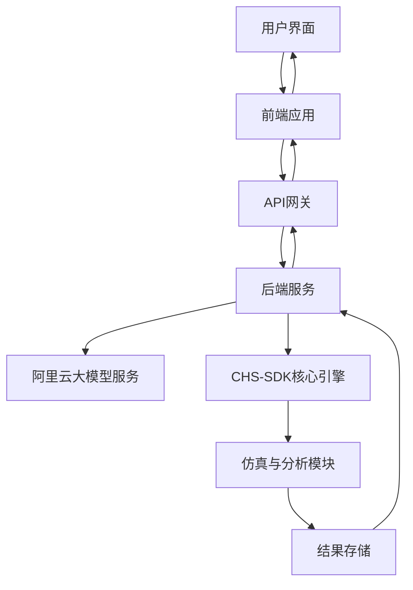

# Claude风格提示词输入系统设计文档

## 1. 概述

## 1. 概述

### 1.1 项目背景
本项目旨在设计并实现一个类似Claude界面的提示词输入系统，专门用于水网建模与分析。该系统将允许用户通过自然语言描述水网建模参数、情景配置、数据查询等需求，并自动生成相应的分析报告。该系统将集成到CHS-SDK平台中，为用户提供更加直观和便捷的水利系统建模与分析体验。

### 1.2 系统目标
- 提供简洁直观的用户界面，包含多行文本输入框、提交按钮和结果显示区域
- 支持自然语言输入，识别用户意图并调用相应后端程序
- 集成阿里通用大模型进行语义理解和任务分发
- 自动生成Markdown格式的分析报告，包含完整的计算过程和分析结果
- 实现响应式设计，适配不同设备并提供实时处理状态反馈
- 支持使用reports目录中的自然语言md文档进行测试验证
- 支持直接部署在阿里云平台上

## 2. 系统架构

### 2.1 整体架构
系统采用前后端分离的Web架构设计：
- 前端：基于React + TypeScript + Ant Design构建用户界面
- 后端：基于FastAPI提供RESTful API服务
- 大模型集成：通过阿里云API调用通义千问大模型
- 通信机制：通过HTTP API和WebSocket实现实时通信



系统将集成到现有的CHS-SDK平台中，利用平台已有的仿真引擎、分析模块和API服务。系统将通过阿里云服务进行部署，利用阿里云的计算、存储和网络资源。

### 2.2 技术栈
- 前端：React, TypeScript, Ant Design, Axios, WebSocket
- 后端：FastAPI, Python, Pydantic
- 大模型：阿里云通义千问API
- 数据格式：JSON, YAML, Markdown

## 3. 用户界面设计

### 3.1 界面组件
1. **多行文本输入框**：用户输入自然语言提示词的主要区域
2. **提交按钮**：触发处理流程
3. **状态指示器**：显示处理进度和状态
4. **结果显示区域**：展示生成的分析报告

### 3.2 界面布局
```mermaid
wireframe
  rectangle "提示词输入系统" {
    rectangle "输入区域" {
      rectangle "文本输入框[高度可调节]" as input
      rectangle "提交按钮" as submit
    }
    rectangle "状态区域" {
      rectangle "处理状态指示器" as status
    }
    rectangle "结果展示区域[支持滚动]" as output
  }
```

### 3.3 响应式设计
- 适配桌面端和移动端显示
- 在小屏幕设备上优化布局和交互方式
- 支持触摸操作和键盘快捷键

## 4. 功能设计

### 4.1 前端功能
#### 4.1.1 用户输入处理
- 提供多行文本输入框，支持用户输入自然语言描述
- 实时验证输入内容
- 提供输入历史记录功能

#### 4.1.2 提交处理
- 点击提交按钮后，禁用输入并显示处理状态
- 通过API将用户输入发送到后端服务
- 处理网络错误和超时情况

#### 4.1.3 结果展示
- 接收后端返回的Markdown格式报告
- 使用Markdown渲染器展示分析结果
- 支持结果导出功能

#### 4.1.4 状态反馈
- 实时显示处理进度
- 提供加载动画和状态信息
- 显示错误信息和处理建议

### 4.2 后端功能
#### 4.2.1 API接口设计
- `/api/prompt/submit` - 接收用户提示词并启动处理流程
- `/api/prompt/status/{task_id}` - 查询处理状态
- `/api/prompt/result/{task_id}` - 获取处理结果

这些接口将基于CHS-SDK平台现有的API架构进行设计和实现，确保与平台其他服务的一致性和兼容性。

#### 4.2.2 自然语言处理
- 接收用户输入的自然语言提示词
- 调用阿里云大模型API进行语义理解和意图识别
- 根据识别结果分发到相应的处理模块

#### 4.2.3 任务调度
- 创建异步处理任务
- 管理任务状态和结果存储
- 提供任务查询接口

#### 4.2.4 报告生成
- 收集分析结果和计算过程数据
- 生成结构化的Markdown报告
- 存储报告并提供访问接口

## 5. 数据模型设计

### 5.1 请求数据模型
```python
class PromptRequest(BaseModel):
    prompt: str  # 用户输入的自然语言提示词
    user_id: Optional[str]  # 用户标识
    session_id: Optional[str]  # 会话标识
```

### 5.2 任务状态模型
```python
class TaskStatus(str, Enum):
    PENDING = "pending"
    PROCESSING = "processing"
    COMPLETED = "completed"
    FAILED = "failed"

class TaskInfo(BaseModel):
    task_id: str
    status: TaskStatus
    created_at: datetime
    started_at: Optional[datetime]
    completed_at: Optional[datetime]
    error_message: Optional[str]
```

### 5.3 结果数据模型
```python
class PromptResult(BaseModel):
    task_id: str
    prompt: str
    result_type: str  # 结果类型（建模参数、情景配置、数据查询、分析需求、报告生成）
    content: str  # Markdown格式的分析报告
    metadata: Dict[str, Any]  # 元数据信息
```

## 6. 大模型集成设计

### 6.1 集成方案
- 使用阿里云通义千问API进行自然语言处理
- 构建专门的提示词模板以提高处理准确性
- 实现错误处理和重试机制
- 集成CHS-SDK平台已有的LLM代理系统，包括LLM系统构建师代理、LLM情景设计师代理、LLM调度指挥官代理和LLM数据分析师代理
- 通过阿里云服务管理大模型API的访问密钥和配额

### 6.2 意图识别
系统需识别以下类型的用户意图：
1. 水网建模参数设置
2. 情景配置
3. 数据查询请求
4. 分析需求
5. 报告生成要求

### 6.3 任务分发
根据识别的用户意图，将任务分发到相应的处理模块：
- 建模参数设置 → 配置生成模块
- 情景配置 → 场景生成模块
- 数据查询 → 数据查询模块
- 分析需求 → 分析引擎模块
- 报告生成 → 报告生成模块

## 7. 测试方案

### 7.1 测试数据来源
使用`reports/all_examples_natural_language.md`中的自然语言描述作为测试数据，验证系统对不同类型输入的处理能力。该文档包含了128个成功转换的配置文件的自然语言描述，可以全面测试系统的意图识别和任务分发能力。

### 7.2 功能测试
1. 用户界面交互测试
2. 自然语言意图识别准确性测试
3. 后端API接口测试
4. 报告生成质量测试

### 7.3 性能测试
1. 响应时间测试
2. 并发处理能力测试
3. 大模型API调用性能测试

### 7.4 兼容性测试
1. 不同浏览器兼容性测试
2. 移动端适配测试
3. 不同屏幕尺寸适配测试

## 8. 安全设计

### 8.1 数据安全
- 用户输入数据加密传输
- 敏感信息脱敏处理
- 结果数据访问控制

### 8.2 API安全
- 接口访问权限控制
- 请求频率限制
- 输入数据验证和过滤

### 8.3 大模型使用安全
- 提示词安全检查
- 敏感信息过滤
- 使用审计日志记录

## 9. 部署方案

### 9.1 部署架构
- 前端应用部署在Nginx服务器上
- 后端服务通过Docker容器化部署
- 使用Kubernetes进行集群管理

系统将作为CHS-SDK平台的一个功能模块进行部署，复用平台现有的部署架构和基础设施。系统将支持直接部署在阿里云平台上，利用阿里云的ECS、SLB、RDS等服务。

### 9.2 阿里云部署方案
系统将通过CHS-SDK平台已有的阿里云集成API进行部署，包括：
- 使用阿里云ECS部署后端服务
- 通过阿里云SLB实现负载均衡
- 利用阿里云容器镜像服务存储Docker镜像
- 通过阿里云SDK管理云资源

部署流程将复用平台现有的`scripts/deploy_aliyun.sh`脚本，该脚本支持：
- 自动构建和推送Docker镜像到阿里云容器镜像服务
- 创建和配置ECS实例
- 部署应用到ECS实例
- 配置负载均衡器

### 9.3 环境配置
系统将通过环境变量配置阿里云服务访问密钥和相关参数：
- `ALIYUN_ACCESS_KEY_ID`：阿里云访问密钥ID
- `ALIYUN_ACCESS_KEY_SECRET`：阿里云访问密钥Secret
- `ALIYUN_REGION`：阿里云地域
- `ALIYUN_ECS_IMAGE_ID`：ECS镜像ID
- `ALIYUN_ECS_INSTANCE_TYPE`：ECS实例类型
- `ALIYUN_ECS_SECURITY_GROUP_ID`：ECS安全组ID
- `ALIYUN_ECS_VSWITCH_ID`：ECS交换机ID

### 9.2 环境要求
- Node.js 18.x (前端构建)
- Python 3.11 (后端服务)
- Docker (容器化部署)
- Kubernetes (集群部署)

## 10. 未来扩展

### 10.1 功能扩展
- 支持更多类型的自然语言输入
- 增加对话式交互能力
- 提供个性化推荐功能

### 10.2 性能优化
- 引入缓存机制提高响应速度
- 优化大模型调用策略
- 实现结果预计算机制

### 10.3 用户体验优化
- 提供输入提示和自动补全
- 增加可视化配置选项
- 支持多语言界面

### 10.4 阿里云集成扩展
- 集成阿里云对象存储OSS用于存储分析报告和日志
- 利用阿里云日志服务进行系统监控和故障排查
- 通过阿里云CDN加速前端资源加载
- 使用阿里云数据库服务存储用户配置和历史记录