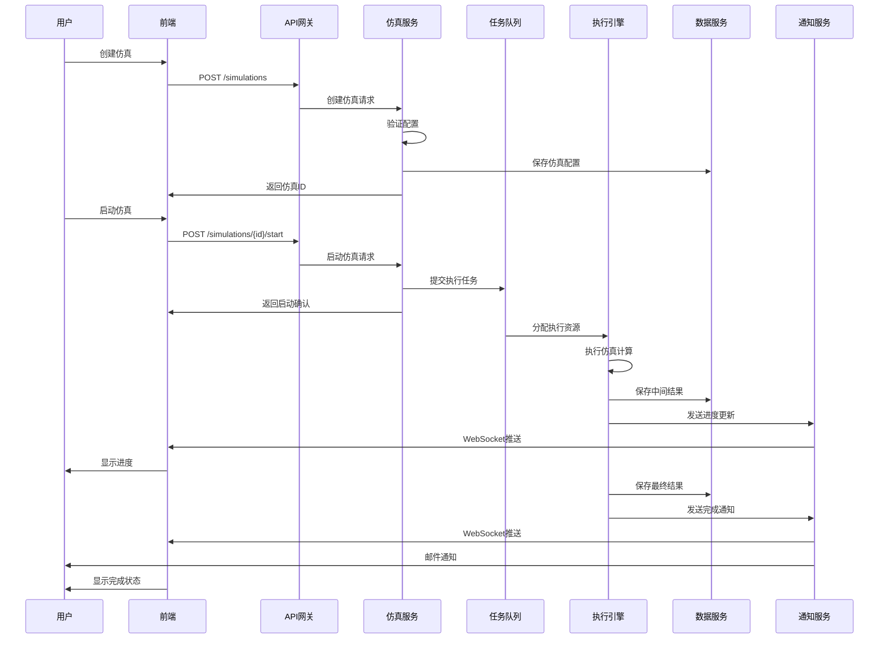

# CHS仿真平台架构文档

## 目录

1. [系统概述](#系统概述)
2. [架构设计原则](#架构设计原则)
3. [整体架构](#整体架构)
4. [技术栈](#技术栈)
5. [模块设计](#模块设计)
6. [数据流设计](#数据流设计)
7. [安全架构](#安全架构)
8. [性能架构](#性能架构)
9. [部署架构](#部署架构)
10. [监控架构](#监控架构)

## 系统概述

### 项目背景

CHS仿真平台是一个面向科学计算和工程仿真的云原生平台，旨在为用户提供高性能、易用的仿真计算服务。平台支持多种仿真类型，包括流体力学、传热传质、结构力学等领域的数值仿真。

### 核心目标

- **高性能**: 支持大规模并行计算，充分利用计算资源
- **易用性**: 提供直观的Web界面，降低使用门槛
- **可扩展**: 模块化设计，支持新仿真类型的快速集成
- **可靠性**: 高可用架构，确保服务稳定运行
- **安全性**: 多层安全防护，保护用户数据和计算资源

### 功能特性

- 🎯 **仿真管理**: 创建、配置、执行、监控仿真任务
- 📊 **数据可视化**: 实时图表、3D渲染、交互式分析
- 👥 **用户管理**: 多租户支持、权限控制、资源配额
- 📁 **文件管理**: 几何文件、网格文件、结果文件的存储和管理
- 🔄 **实时通信**: WebSocket实时状态更新和进度推送
- 📈 **性能监控**: 系统资源监控、仿真性能分析
- 🔐 **安全认证**: JWT认证、OAuth2集成、API密钥管理

## 架构设计原则

### 1. 微服务架构

- **服务拆分**: 按业务领域拆分为独立的微服务
- **松耦合**: 服务间通过API进行通信，减少依赖
- **独立部署**: 每个服务可以独立开发、测试、部署
- **技术多样性**: 不同服务可以选择最适合的技术栈

### 2. 云原生设计

- **容器化**: 所有服务都运行在Docker容器中
- **编排管理**: 使用Kubernetes进行容器编排
- **弹性伸缩**: 根据负载自动扩缩容
- **服务发现**: 自动服务注册和发现

### 3. 数据驱动

- **数据分离**: 计算和存储分离，支持水平扩展
- **多存储**: 根据数据特性选择合适的存储方案
- **数据一致性**: 确保分布式环境下的数据一致性
- **备份恢复**: 完善的数据备份和灾难恢复机制

### 4. 安全优先

- **零信任**: 默认不信任任何网络流量
- **最小权限**: 用户和服务只获得必要的权限
- **数据加密**: 传输和存储数据都进行加密
- **审计日志**: 完整的操作审计和安全日志

## 整体架构

### 架构层次

```
┌─────────────────────────────────────────────────────────────┐
│                        用户层                                │
├─────────────────────────────────────────────────────────────┤
│  Web浏览器  │  移动应用  │  桌面客户端  │  第三方集成        │
└─────────────────────────────────────────────────────────────┘
                              │
                              ▼
┌─────────────────────────────────────────────────────────────┐
│                      接入层                                  │
├─────────────────────────────────────────────────────────────┤
│     CDN     │   负载均衡器   │   API网关   │   防火墙        │
└─────────────────────────────────────────────────────────────┘
                              │
                              ▼
┌─────────────────────────────────────────────────────────────┐
│                      应用层                                  │
├─────────────────────────────────────────────────────────────┤
│  前端服务  │  认证服务  │  API服务  │  WebSocket服务        │
└─────────────────────────────────────────────────────────────┘
                              │
                              ▼
┌─────────────────────────────────────────────────────────────┐
│                      业务层                                  │
├─────────────────────────────────────────────────────────────┤
│ 用户管理 │ 仿真管理 │ 数据处理 │ 文件管理 │ 通知服务        │
└─────────────────────────────────────────────────────────────┘
                              │
                              ▼
┌─────────────────────────────────────────────────────────────┐
│                      数据层                                  │
├─────────────────────────────────────────────────────────────┤
│ PostgreSQL │  Redis   │  MinIO   │ Elasticsearch │ InfluxDB │
└─────────────────────────────────────────────────────────────┘
                              │
                              ▼
┌─────────────────────────────────────────────────────────────┐
│                    基础设施层                                │
├─────────────────────────────────────────────────────────────┤
│   Kubernetes   │   Docker   │   监控系统   │   日志系统     │
└─────────────────────────────────────────────────────────────┘
```

### 核心组件

#### 1. 前端层
- **Web应用**: React + TypeScript构建的单页应用
- **移动端**: React Native跨平台移动应用
- **桌面端**: Electron桌面应用

#### 2. API网关
- **路由管理**: 请求路由和负载均衡
- **认证授权**: 统一的身份验证和权限控制
- **限流熔断**: 防止系统过载和级联故障
- **监控日志**: 请求监控和访问日志

#### 3. 微服务集群
- **用户服务**: 用户注册、登录、权限管理
- **仿真服务**: 仿真任务的创建、执行、监控
- **数据服务**: 仿真数据的存储、查询、分析
- **文件服务**: 文件上传、下载、版本管理
- **通知服务**: 消息推送、邮件通知、WebSocket

#### 4. 数据存储
- **关系数据库**: PostgreSQL存储结构化数据
- **缓存系统**: Redis提供高速缓存
- **对象存储**: MinIO存储文件和大数据
- **搜索引擎**: Elasticsearch提供全文搜索
- **时序数据库**: InfluxDB存储监控指标

## 技术栈

### 前端技术栈

```typescript
// 核心框架
React 18.2+          // UI框架
TypeScript 4.9+      // 类型系统
Vite 4.0+           // 构建工具

// 状态管理
Redux Toolkit 1.9+   // 状态管理
RTK Query 1.9+      // 数据获取

// UI组件库
Ant Design 5.0+     // 组件库
Tailwind CSS 3.0+   // 样式框架

// 数据可视化
ECharts 5.4+        // 图表库
Three.js 0.150+     // 3D渲染

// 工具库
Axios 1.3+          // HTTP客户端
Dayjs 1.11+         // 日期处理
Lodash 4.17+        // 工具函数
```

### 后端技术栈

```python
# 核心框架
FastAPI 0.95+       # Web框架
Python 3.9+         # 编程语言
Uvicorn 0.20+       # ASGI服务器

# 数据库
SQLAlchemy 2.0+     # ORM框架
Alembic 1.9+        # 数据库迁移
Asyncpg 0.27+       # PostgreSQL驱动

# 缓存和消息
Redis 7.0+          # 缓存和消息队列
Celery 5.2+         # 异步任务队列

# 认证和安全
PyJWT 2.6+          # JWT令牌
Passlib 1.7+        # 密码哈希
Cryptography 39.0+  # 加密库

# 工具库
Pydantic 1.10+      # 数据验证
Httpx 0.23+         # HTTP客户端
NumPy 1.24+         # 数值计算
Pandas 2.0+         # 数据处理
```

### 基础设施技术栈

```yaml
# 容器化
Docker 20.10+       # 容器运行时
Kubernetes 1.26+    # 容器编排
Helm 3.11+          # 包管理

# 数据存储
PostgreSQL 15+      # 关系数据库
Redis 7.0+          # 内存数据库
MinIO 2023+         # 对象存储
Elasticsearch 8.6+  # 搜索引擎
InfluxDB 2.6+       # 时序数据库

# 监控和日志
Prometheus 2.42+    # 监控系统
Grafana 9.3+        # 可视化面板
ELK Stack 8.6+      # 日志聚合
Jaeger 1.42+        # 链路追踪

# 服务网格
Istio 1.17+         # 服务网格
Envoy 1.25+         # 代理服务器
```

## 模块设计

### 用户管理模块

```python
# 用户服务架构
class UserService:
    """
    用户管理服务
    
    职责:
    - 用户注册、登录、注销
    - 用户信息管理
    - 权限和角色管理
    - 多因素认证
    """
    
    def __init__(self, db: Database, cache: Cache, auth: AuthService):
        self.db = db
        self.cache = cache
        self.auth = auth
    
    async def register_user(self, user_data: UserCreate) -> User:
        """用户注册"""
        pass
    
    async def authenticate_user(self, credentials: UserCredentials) -> AuthResult:
        """用户认证"""
        pass
    
    async def get_user_permissions(self, user_id: int) -> List[Permission]:
        """获取用户权限"""
        pass
```

### 仿真管理模块

```python
# 仿真服务架构
class SimulationService:
    """
    仿真管理服务
    
    职责:
    - 仿真任务创建和配置
    - 仿真执行和监控
    - 资源调度和管理
    - 结果处理和存储
    """
    
    def __init__(self, 
                 db: Database, 
                 scheduler: TaskScheduler,
                 storage: StorageService,
                 monitor: MonitorService):
        self.db = db
        self.scheduler = scheduler
        self.storage = storage
        self.monitor = monitor
    
    async def create_simulation(self, sim_data: SimulationCreate) -> Simulation:
        """创建仿真任务"""
        pass
    
    async def start_simulation(self, sim_id: int) -> SimulationExecution:
        """启动仿真"""
        pass
    
    async def monitor_simulation(self, sim_id: int) -> SimulationStatus:
        """监控仿真进度"""
        pass
```

### 数据处理模块

```python
# 数据服务架构
class DataService:
    """
    数据处理服务
    
    职责:
    - 仿真数据存储和查询
    - 数据格式转换
    - 数据分析和统计
    - 数据可视化支持
    """
    
    def __init__(self, 
                 db: Database,
                 timeseries_db: TimeSeriesDB,
                 object_storage: ObjectStorage):
        self.db = db
        self.timeseries_db = timeseries_db
        self.object_storage = object_storage
    
    async def store_simulation_data(self, sim_id: int, data: SimulationData):
        """存储仿真数据"""
        pass
    
    async def query_simulation_results(self, query: DataQuery) -> QueryResult:
        """查询仿真结果"""
        pass
    
    async def generate_visualization_data(self, sim_id: int) -> VisualizationData:
        """生成可视化数据"""
        pass
```

## 数据流设计

### 仿真执行流程



### 数据存储策略

```yaml
# 数据分层存储
热数据层:
  存储: Redis
  数据: 活跃仿真状态、用户会话、缓存数据
  保留期: 24小时
  特点: 高速读写、内存存储

温数据层:
  存储: PostgreSQL
  数据: 用户信息、仿真配置、元数据
  保留期: 永久
  特点: 事务支持、关系查询

冷数据层:
  存储: MinIO
  数据: 仿真结果文件、几何文件、备份数据
  保留期: 根据策略
  特点: 大容量、低成本

时序数据层:
  存储: InfluxDB
  数据: 监控指标、性能数据、日志数据
  保留期: 90天
  特点: 时间序列、高压缩比
```

## 安全架构

### 安全层次

```
┌─────────────────────────────────────────────────────────────┐
│                      网络安全层                              │
├─────────────────────────────────────────────────────────────┤
│    防火墙    │    DDoS防护    │    WAF    │    VPN         │
└─────────────────────────────────────────────────────────────┘
                              │
                              ▼
┌─────────────────────────────────────────────────────────────┐
│                      应用安全层                              │
├─────────────────────────────────────────────────────────────┤
│  身份认证  │  授权控制  │  输入验证  │  输出编码  │  CSRF    │
└─────────────────────────────────────────────────────────────┘
                              │
                              ▼
┌─────────────────────────────────────────────────────────────┐
│                      数据安全层                              │
├─────────────────────────────────────────────────────────────┤
│  传输加密  │  存储加密  │  密钥管理  │  数据脱敏  │  备份    │
└─────────────────────────────────────────────────────────────┘
                              │
                              ▼
┌─────────────────────────────────────────────────────────────┐
│                      基础设施安全层                          │
├─────────────────────────────────────────────────────────────┤
│  容器安全  │  镜像扫描  │  网络隔离  │  访问控制  │  审计    │
└─────────────────────────────────────────────────────────────┘
```

### 认证授权流程

```python
# JWT认证流程
class AuthenticationFlow:
    """
    认证授权流程
    """
    
    async def login(self, credentials: UserCredentials) -> AuthResult:
        """
        用户登录流程
        
        1. 验证用户凭据
        2. 检查账户状态
        3. 生成访问令牌
        4. 记录登录日志
        """
        # 验证用户名密码
        user = await self.verify_credentials(credentials)
        if not user:
            raise AuthenticationError("无效的用户凭据")
        
        # 检查账户状态
        if not user.is_active:
            raise AuthenticationError("账户已被禁用")
        
        # 生成JWT令牌
        access_token = self.generate_access_token(user)
        refresh_token = self.generate_refresh_token(user)
        
        # 记录登录日志
        await self.log_login_event(user, success=True)
        
        return AuthResult(
            access_token=access_token,
            refresh_token=refresh_token,
            user=user
        )
    
    async def authorize(self, token: str, required_permission: str) -> bool:
        """
        权限验证流程
        
        1. 验证令牌有效性
        2. 获取用户权限
        3. 检查权限匹配
        """
        # 验证JWT令牌
        payload = self.verify_token(token)
        user_id = payload.get("sub")
        
        # 获取用户权限
        permissions = await self.get_user_permissions(user_id)
        
        # 检查权限
        return required_permission in permissions
```

## 性能架构

### 缓存策略

```python
# 多级缓存架构
class CacheStrategy:
    """
    多级缓存策略
    """
    
    def __init__(self):
        self.l1_cache = MemoryCache()      # 应用内存缓存
        self.l2_cache = RedisCache()       # 分布式缓存
        self.l3_cache = DatabaseCache()    # 数据库查询缓存
    
    async def get(self, key: str) -> Any:
        """
        缓存获取策略
        
        1. 检查L1缓存（内存）
        2. 检查L2缓存（Redis）
        3. 检查L3缓存（数据库）
        4. 从源数据获取
        """
        # L1缓存
        value = self.l1_cache.get(key)
        if value is not None:
            return value
        
        # L2缓存
        value = await self.l2_cache.get(key)
        if value is not None:
            self.l1_cache.set(key, value, ttl=300)  # 5分钟
            return value
        
        # L3缓存
        value = await self.l3_cache.get(key)
        if value is not None:
            await self.l2_cache.set(key, value, ttl=3600)  # 1小时
            self.l1_cache.set(key, value, ttl=300)
            return value
        
        # 从源获取数据
        value = await self.fetch_from_source(key)
        if value is not None:
            await self.set_all_levels(key, value)
        
        return value
```

### 负载均衡

```yaml
# 负载均衡配置
load_balancer:
  algorithm: round_robin  # 轮询算法
  health_check:
    enabled: true
    interval: 30s
    timeout: 5s
    path: /health
  
  upstream_servers:
    - server: api-server-1:8000
      weight: 1
      max_fails: 3
      fail_timeout: 30s
    
    - server: api-server-2:8000
      weight: 1
      max_fails: 3
      fail_timeout: 30s
    
    - server: api-server-3:8000
      weight: 2  # 更高性能服务器
      max_fails: 3
      fail_timeout: 30s
  
  rate_limiting:
    requests_per_second: 1000
    burst_size: 100
    
  connection_pooling:
    max_connections: 1000
    keepalive_timeout: 60s
```

## 部署架构

### Kubernetes部署

```yaml
# 部署架构配置
apiVersion: v1
kind: Namespace
metadata:
  name: chs-platform
---
# API服务部署
apiVersion: apps/v1
kind: Deployment
metadata:
  name: chs-api
  namespace: chs-platform
spec:
  replicas: 3
  strategy:
    type: RollingUpdate
    rollingUpdate:
      maxSurge: 1
      maxUnavailable: 0
  selector:
    matchLabels:
      app: chs-api
  template:
    metadata:
      labels:
        app: chs-api
    spec:
      containers:
      - name: api
        image: chs-platform/api:v1.0.0
        ports:
        - containerPort: 8000
        env:
        - name: DATABASE_URL
          valueFrom:
            secretKeyRef:
              name: chs-secrets
              key: database-url
        resources:
          requests:
            memory: "256Mi"
            cpu: "250m"
          limits:
            memory: "512Mi"
            cpu: "500m"
        livenessProbe:
          httpGet:
            path: /health
            port: 8000
          initialDelaySeconds: 30
          periodSeconds: 10
        readinessProbe:
          httpGet:
            path: /ready
            port: 8000
          initialDelaySeconds: 5
          periodSeconds: 5
---
# 服务配置
apiVersion: v1
kind: Service
metadata:
  name: chs-api-service
  namespace: chs-platform
spec:
  selector:
    app: chs-api
  ports:
  - protocol: TCP
    port: 80
    targetPort: 8000
  type: ClusterIP
---
# 水平扩缩容
apiVersion: autoscaling/v2
kind: HorizontalPodAutoscaler
metadata:
  name: chs-api-hpa
  namespace: chs-platform
spec:
  scaleTargetRef:
    apiVersion: apps/v1
    kind: Deployment
    name: chs-api
  minReplicas: 3
  maxReplicas: 10
  metrics:
  - type: Resource
    resource:
      name: cpu
      target:
        type: Utilization
        averageUtilization: 70
  - type: Resource
    resource:
      name: memory
      target:
        type: Utilization
        averageUtilization: 80
```

### 环境配置

```yaml
# 环境配置管理
environments:
  development:
    replicas: 1
    resources:
      requests:
        memory: "128Mi"
        cpu: "100m"
      limits:
        memory: "256Mi"
        cpu: "200m"
    database:
      host: localhost
      name: chs_dev
    redis:
      host: localhost
      port: 6379
  
  staging:
    replicas: 2
    resources:
      requests:
        memory: "256Mi"
        cpu: "250m"
      limits:
        memory: "512Mi"
        cpu: "500m"
    database:
      host: staging-db.internal
      name: chs_staging
    redis:
      host: staging-redis.internal
      port: 6379
  
  production:
    replicas: 5
    resources:
      requests:
        memory: "512Mi"
        cpu: "500m"
      limits:
        memory: "1Gi"
        cpu: "1000m"
    database:
      host: prod-db-cluster.internal
      name: chs_production
    redis:
      host: prod-redis-cluster.internal
      port: 6379
```

## 监控架构

### 监控体系

```yaml
# 监控架构配置
monitoring:
  metrics:
    prometheus:
      scrape_interval: 15s
      retention: 30d
      targets:
        - job_name: 'chs-api'
          static_configs:
            - targets: ['chs-api:8000']
        - job_name: 'chs-frontend'
          static_configs:
            - targets: ['chs-frontend:3000']
        - job_name: 'postgres'
          static_configs:
            - targets: ['postgres-exporter:9187']
        - job_name: 'redis'
          static_configs:
            - targets: ['redis-exporter:9121']
  
  logging:
    elasticsearch:
      cluster_name: chs-logs
      retention_days: 90
      indices:
        - name: chs-api-logs
          pattern: 'chs-api-*'
        - name: chs-frontend-logs
          pattern: 'chs-frontend-*'
        - name: chs-system-logs
          pattern: 'chs-system-*'
  
  tracing:
    jaeger:
      sampling_rate: 0.1  # 10%采样率
      retention_hours: 168  # 7天
  
  alerting:
    alertmanager:
      rules:
        - name: high_cpu_usage
          condition: cpu_usage > 80%
          duration: 5m
          severity: warning
        
        - name: high_memory_usage
          condition: memory_usage > 90%
          duration: 2m
          severity: critical
        
        - name: api_error_rate
          condition: error_rate > 5%
          duration: 1m
          severity: warning
        
        - name: database_connection_failure
          condition: db_connections_failed > 0
          duration: 30s
          severity: critical
```

### 性能指标

```python
# 关键性能指标
class PerformanceMetrics:
    """
    性能指标定义
    """
    
    # 应用指标
    REQUEST_DURATION = "http_request_duration_seconds"
    REQUEST_COUNT = "http_requests_total"
    ERROR_RATE = "http_request_errors_rate"
    ACTIVE_USERS = "active_users_count"
    
    # 业务指标
    SIMULATION_COUNT = "simulations_total"
    SIMULATION_SUCCESS_RATE = "simulation_success_rate"
    SIMULATION_DURATION = "simulation_execution_duration"
    DATA_PROCESSING_TIME = "data_processing_duration"
    
    # 系统指标
    CPU_USAGE = "system_cpu_usage_percent"
    MEMORY_USAGE = "system_memory_usage_percent"
    DISK_USAGE = "system_disk_usage_percent"
    NETWORK_IO = "system_network_io_bytes"
    
    # 数据库指标
    DB_CONNECTION_COUNT = "database_connections_active"
    DB_QUERY_DURATION = "database_query_duration_seconds"
    DB_SLOW_QUERIES = "database_slow_queries_count"
    
    # 缓存指标
    CACHE_HIT_RATE = "cache_hit_rate_percent"
    CACHE_MEMORY_USAGE = "cache_memory_usage_bytes"
    CACHE_OPERATIONS = "cache_operations_total"
```

---

**文档版本**: v1.0.0  
**创建时间**: 2024年1月20日  
**维护团队**: CHS平台架构团队  
**审核状态**: 已审核

> 本架构文档描述了CHS仿真平台的整体设计思路和技术实现方案，为系统开发、部署和维护提供指导。文档会随着系统演进持续更新。