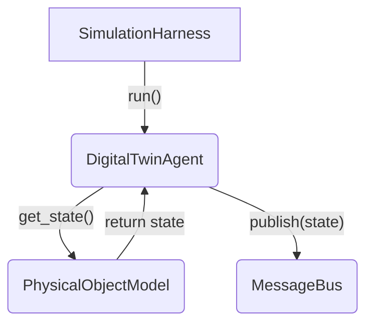

# 核心智能体: 数字孪生代理 (DigitalTwinAgent)

*   **源代码**: `core_lib/local_agents/perception/digital_twin_agent.py`
*   **类型**: 感知代理 (Perception Agent)

## 1. 概述

`DigitalTwinAgent` 是系统中信息流的起点，是连接“物理世界”与“数字世界”的桥梁。在 `core_lib` 的架构中，它不代表整个系统的孪生，而是与一个具体的物理对象模型（如一个`Reservoir`实例）绑定，作为该单一对象的“数字镜像”。

它的核心职责非常清晰：在仿真的每一个时间步，**感知**其内部物理模型的状态，进行可选的**认知增强**，然后将其**发布**到消息总线(`MessageBus`)上。

## 2. 工作机制

### 2.1 封装与发布

*   **封装 (Wrapping)**: 在初始化时，`DigitalTwinAgent` 会接收一个实现了 `Simulatable` 接口的对象实例（即一个物理模型）。它将这个模型保存在内部。
*   **发布 (Publishing)**: `SimulationHarness` 在每个时间步调用 `DigitalTwinAgent` 的 `run()` 方法。该方法会从内部物理模型中获取当前的状态，然后将状态数据作为一条消息，发布到一个预先配置好的主题 (`state_topic`) 上。

### 2.2 认知增强 (Cognitive Enhancement)

`DigitalTwinAgent` 的一个重要功能是对原始状态进行“认知增强”，为系统提供更高质量的数据。代码中的一个典型例子是**状态平滑 (State Smoothing)**。

通过在配置中提供 `smoothing_config`，可以对指定的变量（如 `water_level`）应用**指数移动平均 (Exponential Moving Average, EMA)** 滤波。这个过程可以有效地滤除物理模型或传感器数据中可能存在的高频噪声，为下游的决策智能体（如调度、控制）提供更稳定、更可靠的状态信息。

## 3. 在系统中的角色

*   **作为数据提供者**: `DigitalTwinAgent` 是系统中所有状态信息的主要来源。几乎所有其他类型的智能体都会订阅一个或多个由 `DigitalTwinAgent` 发布的 `state_topic`，以获取它们做出决策所需的信息。
*   **分布式感知**: 系统中通常会存在许多 `DigitalTwinAgent` 实例，每个实例都负责一个物理组件。这种分布式的感知架构使得系统具有很高的模块化和可扩展性。
