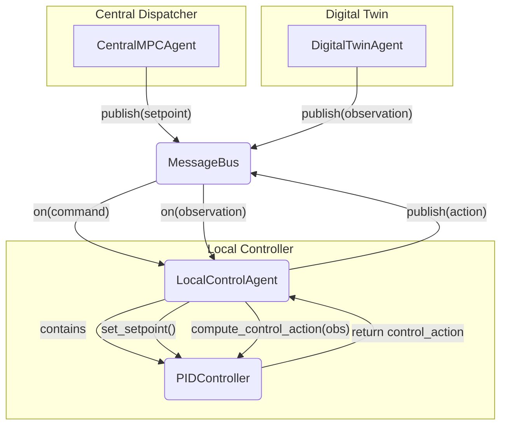

# 核心智能体: 本地控制代理 (LocalControlAgent)

*   **源代码**: `core_lib/local_agents/control/local_control_agent.py`
*   **类型**: 控制代理 (Control Agent)

## 1. 概述

`LocalControlAgent` 是分层控制架构的执行端，负责对单个物理设备（如一个闸门或一个水泵）进行实时的、闭环的反馈控制。

它的核心设计采用了经典的**策略模式 (Strategy Pattern)**，将通用的**通信逻辑**与具体的**控制算法**完全解耦。

## 2. 设计模式：策略模式

`LocalControlAgent` 的设计完美体现了策略模式：

*   **上下文 (Context)**: `LocalControlAgent` 自身扮演了上下文的角色。它负责处理所有与 `MessageBus` 的交互，将复杂的通信细节封装起来。
*   **策略接口 (Strategy Interface)**: `Controller` 接口 (`core_lib/core/interfaces.py`) 定义了所有控制算法必须遵循的统一接口，其核心是 `compute_control_action()` 方法。
*   **具体策略 (Concrete Strategy)**: `PIDController` (`core_lib/local_agents/control/pid_controller.py`) 是一个具体的策略实现。开发者可以轻松编写其他的控制算法（如模糊逻辑、LQR等）作为新的策略。

## 3. 工作流程

`LocalControlAgent` 的工作是完全事件驱动的，其 `run()` 方法通常为空。核心逻辑在消息回调函数中：

1.  **接收设定点**: `handle_command_message()` 方法订阅一个命令主题。当上层的调度智能体（如`CentralMPCAgent`）发布一个新的设定点时，该方法被调用，并更新其内部持有的 `Controller` 实例的设定点（例如，调用 `pid.set_setpoint(new_value)`)。
2.  **接收观测值**: `handle_observation()` 方法订阅一个观测主题（通常由`DigitalTwinAgent`发布）。当新的传感器/模型状态值传来时，该方法被调用。
3.  **计算控制量**: 它将最新的观测值（过程变量）传递给其内部 `Controller` 实例的 `compute_control_action()` 方法。
4.  **执行控制**: `Controller` 实例根据其内部算法（如PID）计算出具体的控制动作（如一个阀门开度值）。
5.  **发布动作**: `LocalControlAgent` 将这个计算出的控制动作发布到一个动作主题 (`action_topic`) 上，供对应的物理对象模型订阅和执行。

## 4. `PIDController` 详解

`PIDController` 是 `core_lib` 提供的一个功能强大的具体控制策略。除了标准的比例、积分、微分控制逻辑外，它还实现了一个重要的现实世界功能：**抗积分饱和 (Anti-Windup)**。

当控制的执行器（如阀门）已经达到其物理极限（全开或全关）时，如果控制器仍然在累积积分项，会导致所谓的“积分饱和”。一旦系统状态回归，这个过饱和的积分项会导致系统响应严重超调和振荡。`PIDController` 的抗积分饱和逻辑可以防止这种情况的发生，确保了控制的平稳和鲁棒性。
