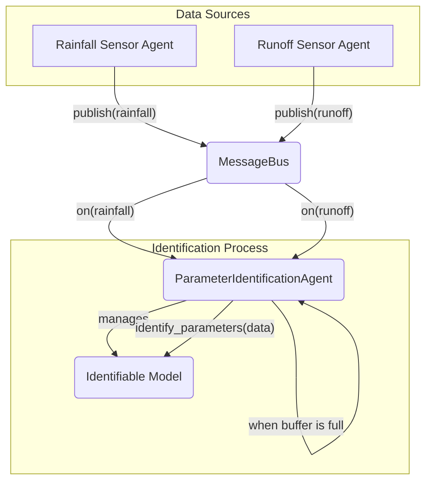

# 核心智能体: 参数辨识代理 (ParameterIdentificationAgent)

*   **源代码**: `core_lib/identification/identification_agent.py`
*   **类型**: 感知/学习代理 (Perception/Learning Agent)

## 1. 概述

`ParameterIdentificationAgent` 负责实现模型的**在线参数自适应校准**。它通过持续不断地将模型的模拟输出与真实的观测数据进行比较，来动态地调整和优化模型的内部参数，使得模型能够更好地反映真实物理世界的行为。

## 2. 核心理念：事件驱动的在线辨识

与需要手动准备数据、离线运行的传统模型率定不同，`ParameterIdentificationAgent` 被设计为一个在后台持续运行的、事件驱动的智能体。

它的工作流程体现了“持续学习”的思想：
1.  **监听**: 同时监听模型输入（如降雨）和对应的真实世界输出（如观测径流）的数据流。
2.  **积累**: 在内存中积累一个批次的新数据。
3.  **触发**: 当数据积累到一定数量后，触发一次参数辨识过程。
4.  **更新**: 将辨识出的新参数更新回模型本身。
5.  **重复**: 清空数据，开始下一轮的监听和积累。

## 3. 工作机制

### 3.1 `Identifiable` 接口

为了让一个模型能够被此代理校准，该模型必须实现 `Identifiable` 接口 (`core_lib/core/interfaces.py`)。这个接口的核心是 `identify_parameters()` 方法，它接收一个包含多种输入输出时间序列数据的字典，并负责执行具体的参数优化算法。

### 3.2 `ParameterIdentificationAgent` 的工作流程

1.  **初始化**: 在创建时，`ParameterIdentificationAgent` 会被赋予一个它需要负责的 `target_model` (目标模型)，以及一个 `identification_data_map` 配置。这个 map 定义了需要从消息总线的哪些 `topic` 上获取哪些数据（例如，`{'rainfall': 'topic_A', 'observed_runoff': 'topic_B'}`）。
2.  **订阅**: 代理根据 `identification_data_map` 向 `MessageBus` 订阅所有需要的主题。
3.  **收集数据**: `handle_data_message` 回调函数会将收到的消息存入内部的 `data_history` 字典中。
4.  **检查与触发**: `run()` 方法在每个时间步被调用，检查 `new_data_count` 是否达到阈值 (`identification_interval`)。
5.  **调用辨识**: 一旦达到阈值，它就将 `data_history` 中的数据打包成 `numpy` 数组，并调用 `self.target_model.identify_parameters(data_for_model)`。

## 4. 在系统中的角色

`ParameterIdentificationAgent` 在系统中扮演着“模型维护工程师”的角色。它使得数字孪生系统具有了**自适应**和**自学习**的能力。随着时间的推移，物理世界本身可能会发生变化（如管道老化导致糙率增加，下垫面硬化导致产流系数改变），通过这个在线辨识代理，系统中的数字模型可以自动地跟上这些变化，而无需人工干预，从而保证了长期仿真的准确性。
