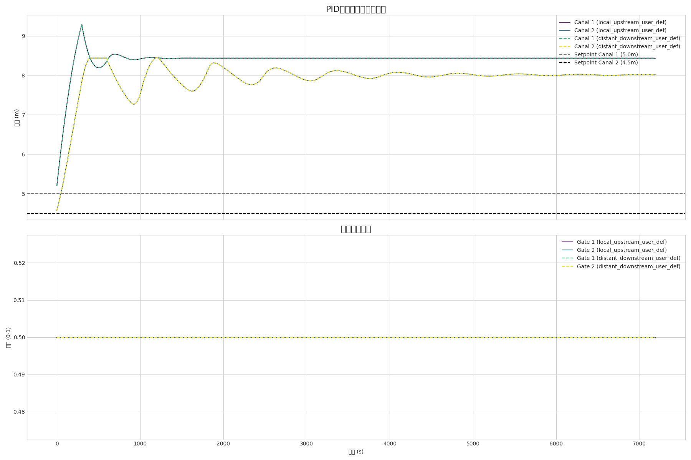

# 渠道系统PID控制策略对比

本示例演示并比较了三种不同的PID控制策略，用于调节一个由两个闸门和三个串联渠段组成的渠道系统中的水位。

## 系统描述

模拟的系统包括：
- 一个`upstream_reservoir`（上游水库），提供稳定的水源。
- 两个`gates`（闸门）（`gate_1`, `gate_2`），用于控制流量。
- 三个`canal reaches`（渠段）（`canal_1`, `canal_2`, `canal_3`），使用`IntegralDelayCanal`（积分延迟渠道）物理模型进行建模。该模型模拟了真实渠道的蓄水和时滞特性。

这些组件串联连接：
`水库 -> 闸门1 -> 渠道1 -> 渠道2 -> 闸门2 -> 渠道3`

## 控制策略比较

本示例的核心是比较不同的控制架构如何处理这个串联系统中的耦合和延迟。我们评估了三种不同的策略：

### 1. 本地上游控制 (Local Upstream Control)
- **闸门1** 控制 **渠道1** 的水位。
- **闸门2** 控制 **渠道2** 的水位。
这是一种完全分散的策略。每个控制器只使用本地信息。这种策略实现简单，但由于忽略了下游动态，性能可能不佳。

### 2. 远程下游控制 (Distant Downstream Control)
- **闸门1** 控制 **渠道2** 的水位。
- **闸门2** 控制 **渠道3** 的水位。
该策略试图控制更下游的水位，可以提供更稳定的全系统调节，但由于存在较长的时滞，整定难度更大。

### 3. 混合控制 (Mixed Control)
- **闸门1** 控制 **渠道1** 的水位（本地）。
- **闸门2** 控制 **渠道3** 的水位（远程）。
这是一种混合方法，结合了本地控制和远程控制的元素。

## 如何运行示例

要运行模拟并生成比较图，请从代码库的根目录执行以下命令：

```bash
python examples/canal_model/canal_pid_control/run_pid_comparison.py
```

该脚本将依次运行所有三个场景，并将结果保存到`results_local_upstream.csv`、`results_distant_downstream.csv`和`results_mixed_control.csv`。它还将生成一个名为`pid_comparison_results.png`的比较图。

## 预期结果

生成的图表将显示三种控制策略下三个渠道的水位和两个闸门的开度。这使得可以直观地比较它们在稳定性、响应时间和维持期望设定值方面的性能。


