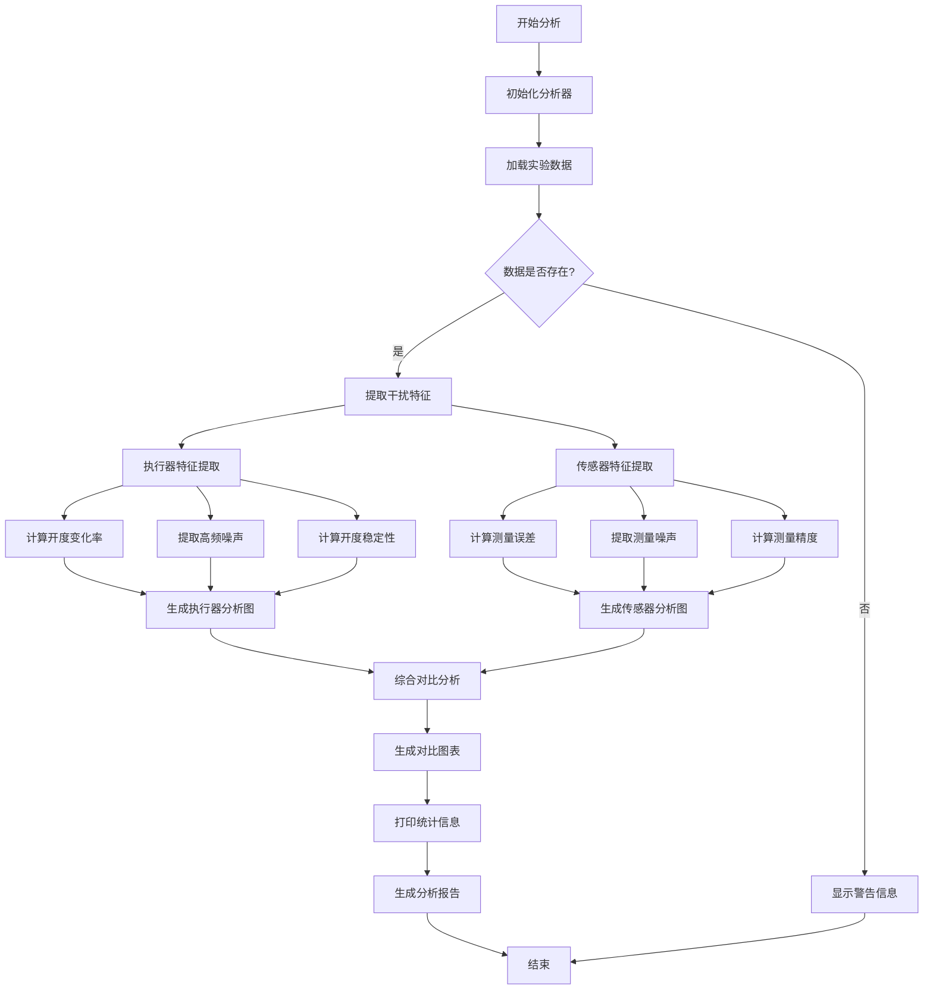

# 执行器和传感器干扰分析 - Streamlit Web界面

## 概述

这是一个基于 Streamlit 的 Web 应用，用于分析水利系统中执行器（闸门）和传感器（水位计）的干扰特征。该应用提供了直观的交互界面，支持数据上传、实时分析和结果可视化。

## 功能特性

### 🔧 执行器分析
- **开度稳定性分析**: 计算闸门开度的标准差，评估执行器稳定性
- **响应速度分析**: 分析开度变化率，评估执行器动态响应特性
- **噪声特征分析**: 提取高频噪声成分，评估执行器精度和平滑性

### 📈 传感器分析
- **测量精度分析**: 计算测量值与目标值的平均绝对误差
- **测量精密度分析**: 分析去趋势后噪声的标准差
- **噪声特性分析**: 提取高频测量噪声的RMS值

### 📊 可视化功能
- **交互式图表**: 使用 Plotly 创建可交互的时间序列图
- **多维度对比**: 支持不同模式和场景的对比分析
- **实时统计**: 显示详细的统计信息和性能指标

## 安装和运行

### 方法1: 使用启动脚本（推荐）

```bash
# 进入应用目录
cd examples/distributed_digital_twin_simulation

# 运行启动脚本
python run_streamlit_app.py
```

### 方法2: 手动安装和运行

```bash
# 安装依赖
pip install -r requirements_streamlit.txt

# 运行应用
streamlit run actuator_sensor_disturbance_streamlit.py
```

## 使用说明

### 1. 数据准备

确保你的CSV数据文件包含以下列：

**必需的列名：**
- `time`: 时间序列数据
- `Gate_1_opening`: 1号闸门开度
- `Gate_1_upstream_level`: 1号闸门上游水位
- `Gate_2_opening`: 2号闸门开度
- `Gate_2_upstream_level`: 2号闸门上游水位
- `Gate_3_opening`: 3号闸门开度
- `Gate_3_upstream_level`: 3号闸门上游水位

**数据格式要求：**
- CSV格式文件
- 数值型数据
- 时间序列按行排列

### 2. 界面操作

1. **上传数据**: 在侧边栏选择CSV文件上传
2. **选择模式**: 选择分析的控制模式（rule/mpc）
3. **选择场景**: 选择分析的工况场景
4. **调整参数**: 根据需要调整滤波器参数
5. **查看结果**: 在标签页中查看分析结果

### 3. 结果解读

#### 执行器分析结果
- **稳定性**: 数值越小表示执行器越稳定
- **变化率**: 反映执行器响应速度，过高可能表示控制过于频繁
- **噪声RMS**: 反映执行器精度，数值越小表示精度越高

#### 传感器分析结果
- **测量精度**: 与目标值的平均误差，数值越小表示精度越高
- **测量精密度**: 测量的一致性，数值越小表示精密度越高
- **噪声RMS**: 测量噪声水平，数值越小表示噪声越小

## 业务逻辑流程



## 技术架构

### 前端界面
- **Streamlit**: Web应用框架
- **Plotly**: 交互式图表库
- **Pandas**: 数据处理

### 后端分析
- **NumPy**: 数值计算
- **SciPy**: 信号处理
- **Matplotlib**: 图表生成

### 核心模块
1. **数据加载模块**: 处理CSV文件上传和验证
2. **特征提取模块**: 提取执行器和传感器特征
3. **信号处理模块**: 滤波、去趋势、噪声分析
4. **可视化模块**: 生成交互式图表
5. **统计分析模块**: 计算性能指标

## 文件结构

```
distributed_digital_twin_simulation/
├── actuator_sensor_disturbance_analysis.py      # 原始分析脚本
├── actuator_sensor_disturbance_streamlit.py     # Streamlit Web应用
├── actuator_sensor_disturbance_flow.md          # 业务逻辑图
├── run_streamlit_app.py                         # 启动脚本
├── requirements_streamlit.txt                   # 依赖包列表
└── README_streamlit.md                          # 使用说明
```

## 故障排除

### 常见问题

1. **数据加载失败**
   - 检查CSV文件格式
   - 确保包含必需的列名
   - 检查数据编码（建议使用UTF-8）

2. **图表显示异常**
   - 检查数据是否包含NaN值
   - 确保数值列的数据类型正确
   - 检查时间序列数据是否连续

3. **依赖安装失败**
   - 确保Python版本 >= 3.7
   - 使用虚拟环境隔离依赖
   - 检查网络连接

### 性能优化

1. **大数据文件处理**
   - 考虑数据采样
   - 使用分块处理
   - 优化内存使用

2. **图表渲染优化**
   - 限制数据点数量
   - 使用数据聚合
   - 启用图表缓存

## 扩展功能

### 计划中的功能
- [ ] 多文件批量分析
- [ ] 自定义分析参数
- [ ] 结果导出功能
- [ ] 历史分析记录
- [ ] 实时数据监控

### 自定义开发
- 修改 `actuator_sensor_disturbance_streamlit.py` 添加新功能
- 在 `ActuatorSensorDisturbanceAnalyzer` 类中添加新的分析方法
- 使用 Streamlit 组件扩展界面功能

## 联系支持

如有问题或建议，请通过以下方式联系：
- 提交 Issue 到项目仓库
- 发送邮件到技术支持
- 查看项目文档获取更多信息
