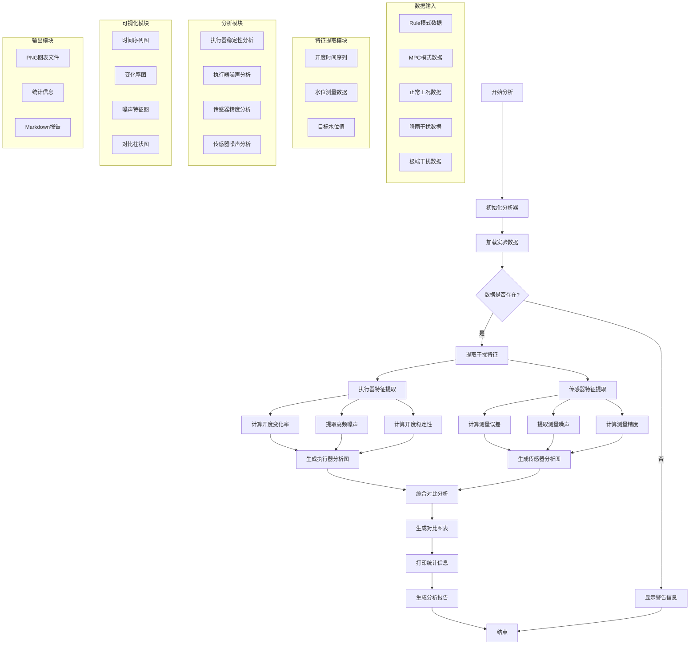

# 执行器和传感器干扰分析业务逻辑图

## 模块依赖关系

### 1. 数据层
- **数据加载模块**: 负责从CSV文件加载实验数据
- **数据验证模块**: 检查数据完整性和有效性

### 2. 特征提取层
- **执行器特征提取**: 开度变化率、噪声、稳定性
- **传感器特征提取**: 测量误差、噪声、精度

### 3. 分析层
- **信号处理模块**: 滤波、去趋势、统计分析
- **特征计算模块**: RMS、标准差、均值计算

### 4. 可视化层
- **时间序列绘图**: 原始数据和趋势
- **对比分析绘图**: 不同模式间的对比
- **统计图表**: 柱状图、散点图等

### 5. 输出层
- **图表生成**: PNG格式的高质量图表
- **报告生成**: Markdown格式的分析报告
- **统计输出**: 控制台打印的统计信息

## 关键流程

1. **初始化** → 设置分析参数和结果目录
2. **数据加载** → 按模式和场景加载实验数据
3. **特征提取** → 分别提取执行器和传感器特征
4. **信号处理** → 滤波、去趋势、噪声分析
5. **统计分析** → 计算各种统计指标
6. **可视化** → 生成多种类型的分析图表
7. **报告生成** → 输出分析报告和统计信息
