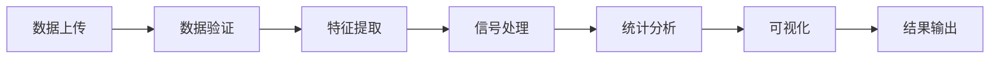
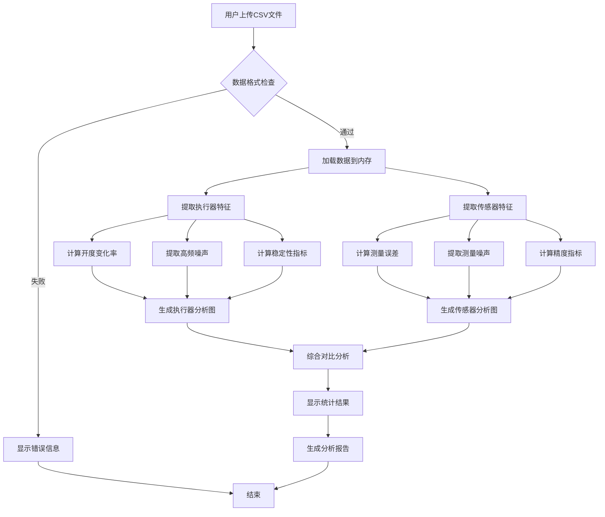
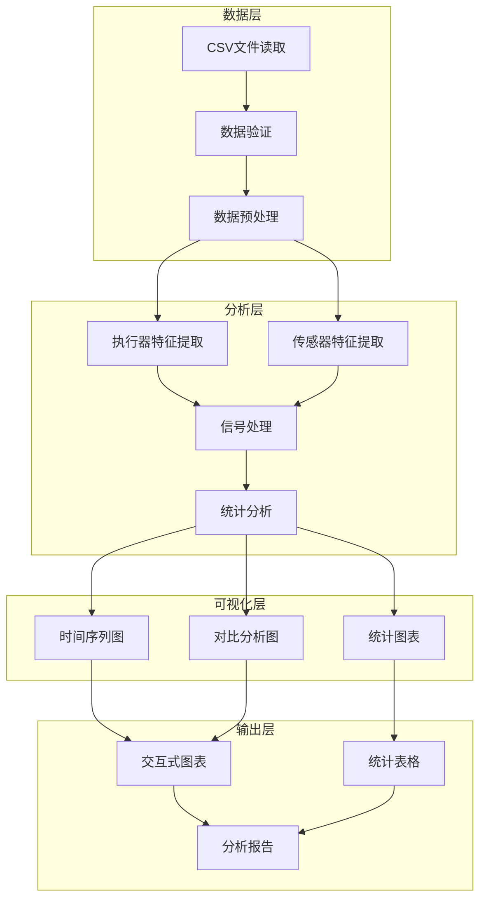

# 执行器和传感器干扰分析 - 简化流程图

## 系统架构图

## 详细业务流程图

## 模块依赖关系

## 关键步骤说明

### 1. 数据输入阶段
- **文件上传**: 用户通过Web界面上传CSV文件
- **格式验证**: 检查文件格式和必需列的存在
- **数据加载**: 将数据加载到Pandas DataFrame

### 2. 特征提取阶段
- **执行器特征**: 从闸门开度数据中提取特征
- **传感器特征**: 从水位测量数据中提取特征
- **时间序列处理**: 处理时间维度的数据

### 3. 信号处理阶段
- **滤波处理**: 使用Butterworth滤波器提取噪声
- **去趋势**: 分离趋势和噪声成分
- **统计分析**: 计算各种统计指标

### 4. 可视化阶段
- **交互式图表**: 使用Plotly创建可交互的图表
- **多维度展示**: 同时展示多个维度的分析结果
- **对比分析**: 支持不同模式间的对比

### 5. 结果输出阶段
- **统计表格**: 以表格形式展示数值结果
- **分析报告**: 生成详细的分析报告
- **图表导出**: 支持图表下载和保存
