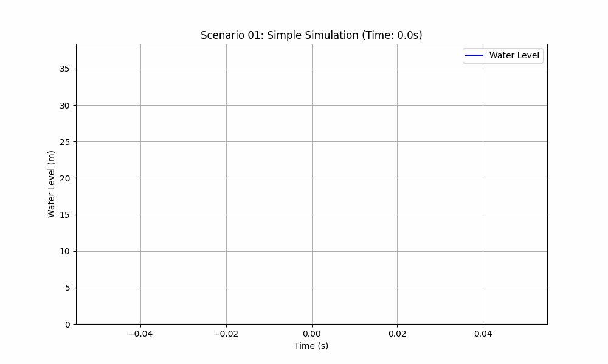

# 场景一：简单仿真

本场景是`watertank`系列中最基础的示例，旨在演示一个由CSV文件驱动的简单开环仿真。

## 场景描述

- **目标**: 模拟一个水库，其入流量由一个预定义的CSV文件 (`inflow.csv`) 提供。
- **控制策略**: 无（开环）。系统中没有主动的控制代理。
- **驱动**: 一个`CsvInflowAgent`从CSV文件读取数据，并将其作为水库的入流量。
- **时长**: 仿真运行200个时间步。

## Agent与组件配置

- `inflow_agent_1` (`CsvInflowAgent`): 这是场景中唯一的代理。它按时间顺序读取`inflow.csv`文件中的`inflow_rate`列，并将数据发布到`inflow_topic`主题。
- `reservoir_1` (`Reservoir`): 这是一个物理水库组件。它订阅`inflow_topic`主题来获取其入流量。

## 仿真结果

下面的GIF图展示了在持续入流下，水库水位随时间线性上升的过程。

## 关键性能指标 (KPIs)

| 指标 (Indicator) | 值 (Value) |
| :--- | :--- |
| 总入流量 (Total Inflow) | 300.00 m³ |
| 最终水位 (Final Water Level) | 32.00 m |

## 分析

这是一个最简单的“数字孪生”用例。`CsvInflowAgent`扮演了数据源的角色，模拟了外部世界（例如，上游流量计）的数据输入。`Reservoir`组件则作为物理实体的数字孪生，根据收到的数据更新其自身状态（水位）。由于没有控制或干预，水库的水位完全由输入的流量数据决定。
