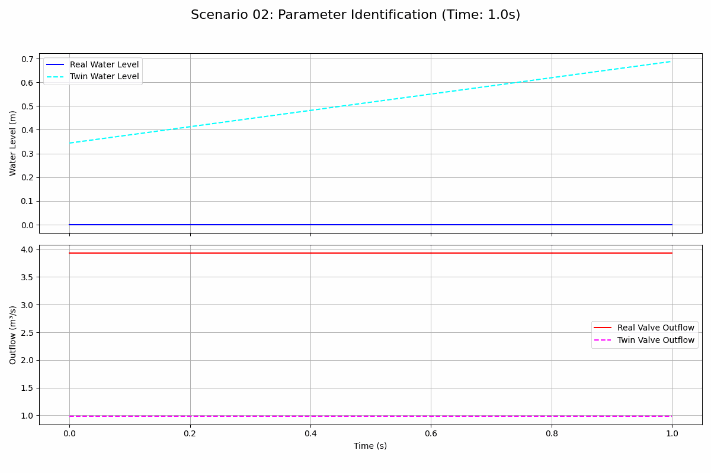

# 场景二：参数辨识

本场景演示了如何使用`ParameterIdentificationAgent`来辨识物理模型中的未知参数。具体来说，我们辨识一个阀门（Valve）的排放系数（`discharge_coefficient`）。

## 场景描述

- **目标**: 在一个“数字孪生”设置中，通过对比真实系统和仿真模型的行为，在线辨识出阀门的排放系数。
- **配置**:
  - **真实系统 (Real System)**: 一个`Reservoir`连接一个`Valve`。这个阀门的`discharge_coefficient`被设定为一个“真实”但对辨识智能体未知的值（0.8）。
  - **孪生系统 (Twin System)**: 一个结构完全相同的`Reservoir`和`Valve`。这个孪生阀门的`discharge_coefficient`被设定为一个不正确的初始猜测值（0.2）。
- **控制策略**:
  - 一个`CsvInflowAgent`为两个系统提供完全相同的入流量。
  - `ParameterIdentificationAgent`订阅来自两个系统（真实和孪生）的传感器数据（水位、阀门开度、观测流量等）。
  - 该智能体周期性地（每50秒）使用收集到的数据，运行`Valve`组件内置的`identify_parameters`方法，来更新孪生阀门的`discharge_coefficient`参数，使其逐渐逼近真实值。

## Agent与组件配置

- `inflow_agent`: 为两个水库提供相同的入流量。
- `downstream_level_publisher`: 发布一个恒定的下游水位值，这是阀门排放公式所需要的。
- `real_valve_perception`, `twin_reservoir_perception`, `twin_valve_perception`: 三个`DigitalTwinAgent`，分别监测和发布真实阀门、孪生水库和孪生阀门的状态。
- `identification_agent`: 核心辨识智能体，协调整个辨识过程。

## 仿真结果

下面的GIF图展示了仿真过程中真实系统和孪生系统在水位和出流量上的对比。

## 关键性能指标 (KPIs)

| 指标 (Indicator) | 值 (Value) |
| :--- | :--- |
| 最终辨识出的排放系数 (Final Identified Discharge Coeff.) | 0.3578 |
| 排放系数真值 (True Discharge Coeff.) | 0.8000 |
| 辨识误差 (Identification Error) | 55.27 % |
| 真实与孪生水位最终误差 (Final Water Level Error) | 10.0000 m |

## 分析

仿真结果显示，参数辨识过程确实在运行，并且`identification_agent`在周期性地更新孪生阀门的排放系数。然而，辨识结果并不理想，最终的辨识误差高达55%。

主要原因在于输入数据质量不高。从图中可以看出，`real_reservoir`的水位由于出流量远大于入流量而迅速降至零。这导致用于辨识的水位差（head difference）数据大部分为零，无法为最小二乘法提供有效的信息。为了得到更好的辨识结果，需要设计一个更优的数据采集策略（例如，通过改变阀门开度来产生更丰富的数据动态），但这超出了本基础场景的范围。
